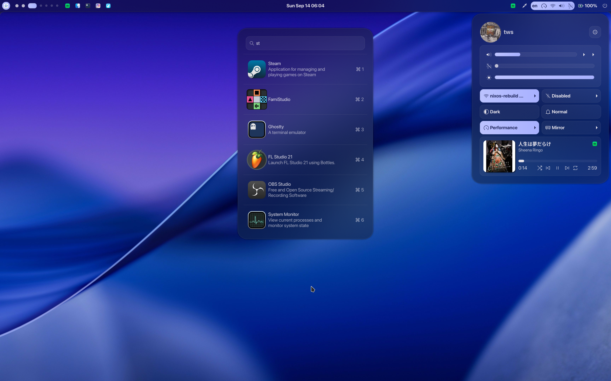

# ags2-shell



A port of Aylur's AGS shell from AGS v1 to AGS v2 (and now to v3), with a subset of features and slight tweaks. Tightly coupled with Hyprland.

## Acknowledgments
Special thanks to [Aylur](https://github.com/Aylur) for the original [AGS v1 shell](https://github.com/Aylur/dotfiles/tree/18b83b2d2c6ef2b9045edefe49a66959f93b358a), [Astal](https://github.com/Aylur/Astal), and the [AGS CLI](https://github.com/Aylur/ags).

Check out and support his latest project **[Marble Shell](https://marble-shell.pages.dev)**, the new and expanded version of the AGS shell with more features and improvements.

## ⚠ Planned
- NixOS configuration for ui?

## Installation on NixOS
### As a bundled package
flake.nix:
```nix
{}: {
  inputs = {
    ags = {
      url = "github:Aylur/ags";
      inputs.nixpkgs.follows = "nixpkgs";
    };

    ags2-shell = {
      url = "github:TheWolfStreet/ags2-shell";
    };
  };
}
```

Then use packages:
```nix
{ config, pkgs, inputs, ... }:

{
  # home.packages if using home manager
  environment.systemPackages = [
    inputs.ags.packages.${pkgs.system}.default
    inputs.ags2-shell.packages.${pkgs.system}.default
  ];
}
```

Next, set up Hyprland as outlined in the "Hyprland (Home Manager)" section below
### Home Manager
flake.nix:
```nix
{}: {
  inputs = {
    apple-fonts.url = "github:Lyndeno/apple-fonts.nix";
    matugen.url = "github:InioX/matugen?ref=v2.2.0";
    ags = {
      url = "github:Aylur/ags";
      inputs.nixpkgs.follows = "nixpkgs";
    };
  };
}
```

In a Home Manager file:
```nix
{
inputs,
pkgs,
...
}: {
  imports = [inputs.ags.homeManagerModules.default];
  programs.ags = {
    enable = true;
    # WARNING: For nix flakes to see submodules set inputs.self.submodules = true
    configDir = ../ags2-shell; # Path to this repository
    # And a few expected things in the environment like bash and which
    extraPackages = with pkgs; [
      brightnessctl # Setting brightness
      swww # Wallpaper
      which # Dependency checking
      # Recording and screenshot functionality
      libnotify # "Recording saved" or "Screenshot taken" notifications
      wayshot # Screenshot software
      wf-recorder # Recording software
      swappy # Edit screenshot button
      slurp # Area selector
      #---
      libheif # Converting heif wallpapers for swww
      wl-clipboard # Copying colors from the colorpicker
      hyprpicker # Colorpicker
      pavucontrol # Audio control
      networkmanager # Network control
      matugen # Dynamic coloring
      # Astal libs
      inputs.ags.packages.${pkgs.system}.apps
      inputs.ags.packages.${pkgs.system}.battery
      inputs.ags.packages.${pkgs.system}.hyprland
      inputs.ags.packages.${pkgs.system}.wireplumber
      inputs.ags.packages.${pkgs.system}.network
      inputs.ags.packages.${pkgs.system}.tray
      inputs.ags.packages.${pkgs.system}.battery
      inputs.ags.packages.${pkgs.system}.notifd
      inputs.ags.packages.${pkgs.system}.mpris
      inputs.ags.packages.${pkgs.system}.bluetooth
      inputs.ags.packages.${pkgs.system}.auth
      inputs.ags.packages.${pkgs.system}.powerprofiles
    ];
	};
}
```

Apply the recommended gtk settings to match the appearance shown in the example screenshot:
## Recommended GTK settings (Home Manager)
```nix
{
  inputs,
  config,
  pkgs,
  ...
}: let
  theme = {
    name = "adw-gtk3-dark";
    package = pkgs.adw-gtk3;
  };
  font = {
    name = "SF Pro Display Nerd Font";
    size = 11;
    package = inputs.apple-fonts.packages.${pkgs.system}.sf-pro-nerd;
  };
  cursorTheme = {
    name = "Qogir";
    size = 24;
    package = pkgs.qogir-icon-theme;
  };
  iconTheme = {
    name = "WhiteSur";
    package = pkgs.whitesur-icon-theme;
  };
in {
  home = {
    packages = [
      theme.package
      font.package
      cursorTheme.package
      iconTheme.package
    ];
    sessionVariables = {
      XCURSOR_THEME = cursorTheme.name;
      XCURSOR_SIZE = "${toString cursorTheme.size}";
    };
    pointerCursor =
      cursorTheme
      // {
        gtk.enable = true;
      };
  };

  fonts.fontconfig.enable = true;

  gtk = {
    inherit iconTheme cursorTheme;
    theme.name = theme.name;
    enable = true;
  };

  qt = {
    platformTheme.name = "gtk3";
  };

  home.file.".local/share/flatpak/overrides/global".text = let
    dirs = [
      "/nix/store:ro"
      "/run/current-system/sw/share/X11/fonts:ro"
      "xdg-config/gtk-3.0:ro"
      "xdg-config/gtk-4.0:ro"
      "${config.xdg.dataHome}/icons:ro"
    ];
  in ''
    [Context]
    filesystems=${builtins.concatStringsSep ";" dirs}
  '';
}
```


## Hyprland (Home Manager)
To integrate with Hyprland, add the following to your configuration:
```nix
wayland.windowManager.hyprland = {
  settings = {
    exec-once = [
      # WARNING: If a bundle is used, use ags2-shell instead of ags run
      "ags run"
    ];

    bind = let
      e = "exec, ags -i ags2-shell";
    in
    [
      # Restart shell (just in case)
      # WARNING: If a bundle is used, use ags2-shell instead of ags run
      "CTRL ALT, Delete,   ${e} quit; ags run"
      # Open the application launcher
      "SUPER, R,           ${e} toggle launcher"
      # Open workspace overview
      "SUPER, Tab,         ${e} toggle overview"
      # Display shutdown confirmation prompt
      ",XF86PowerOff,      ${e} request 'shutdown'"
      # Start area recording
      "SUPER, Print,       ${e} request 'record-area'"
      # Start full-screen recording
      "SUPER SHIFT, Print, ${e} request 'record'"
      # Take full-screen screenshot
      ", Print,            ${e} request 'screenshot'"
      # Take area screenshot
      "SHIFT, Print,       ${e} request 'screenshot-area'"
    ];

    decoration = {
      shadow = {
        enabled = true;
        range = 8;
        render_power = 2;
        color = "rgba(00000044)";
      };

      dim_inactive = false;

      blur = {
        enabled = true;
        size = 5;
        passes = 5;
        new_optimizations = "on";
        noise = 0.01;
        contrast = 1.0;
        brightness = 0.9;
        popups = true;
      };
    };

    layerrule = [
      "blur on, match:namespace gtk4-layer-shell"
      "blur_popups on, match:namespace gtk4-layer-shell"
      "ignore_alpha 0.29, match:namespace gtk4-layer-shell"
      "no_anim on, match:namespace gtk4-layer-shell"
    ];
  };
};
```

## Hyprlock (Home Manager)
A complementary Hyprlock config (optional):
```nix
programs.hyprlock = {
  enable = true;
  settings = {
    background = {
      path = "screenshot";
      blur_passes = 5;
      contrast = 0.8916;
      brightness = 0.8172;
      vibrancy = 0.1696;
      vibrancy_darkness = 0.0;
    };
    general = {
      no_fade_in = false;
      grace = 0;
      disable_loading_bar = false;
    };

    label = [
      {
        text = "cmd[update:1000] echo -e \"$(date +\"%A, %B %d\")\"";
        color = "rgba(216, 222, 233, 0.70)";
        font_size = 25;
        font_family = "SF Pro Display Nerd Font Bold";
        position = "0, 350";
        halign = "center";
        valign = "center";
      }
      {
        text = "cmd[update:1000] echo \"<span>$(date +\"%H:%M\")</span>\"";
        color = "rgba(216, 222, 233, 0.70)";
        font_size = 120;
        font_family = "SF Pro Display Nerd Font Bold";
        position = "0, 250";
        halign = "center";
        valign = "center";
      }
      {
        text = "$USER";
        color = "rgba(216, 222, 233, 0.80)";
        font_size = 20;
        font_family = "SF Pro Display Nerd Font Bold";
        position = "0, -82";
        halign = "center";
        valign = "center";
      }
    ];

    image = {
      path = "/var/lib/AccountsService/icons/$USER";
      border_size = 2;
      border_color = "rgba(255, 255, 255, .65)";
      size = 180;
      rounding = -1;
      rotate = 0;
      reload_time = -1;
      reload_cmd = "";
      position = "0, 40";
      halign = "center";
      valign = "center";
    };

    input-field = {
      size = "125, 50";
      dots_center = true;
      outline_thickness = 0;
      outer_color = "rgba(0, 0, 0, 0)";
      inner_color = "rgba(255, 255, 255, 0.1)";
      check_color = "rgba(255, 255, 255, 0.1)";
      fail_color = "rgba(255, 255, 255, 0.1)";
      capslock_color = "rgba(255, 255, 255, 0.1)";
      numlock_color = "rgba(255, 255, 255, 0.1)";
      bothlock_color = "rgba(255, 255, 255, 0.1)";
      font_color = "rgb(200, 200, 200)";
      fade_on_empty = false;
      font_family = "SF Pro Display Nerd Font Regular";
      placeholder_text = "Password";
      fail_text = "Incorrect";
      hide_input = false;
      position = "0, -140";
      halign = "center";
      valign = "center";
    };
  };
};
```
