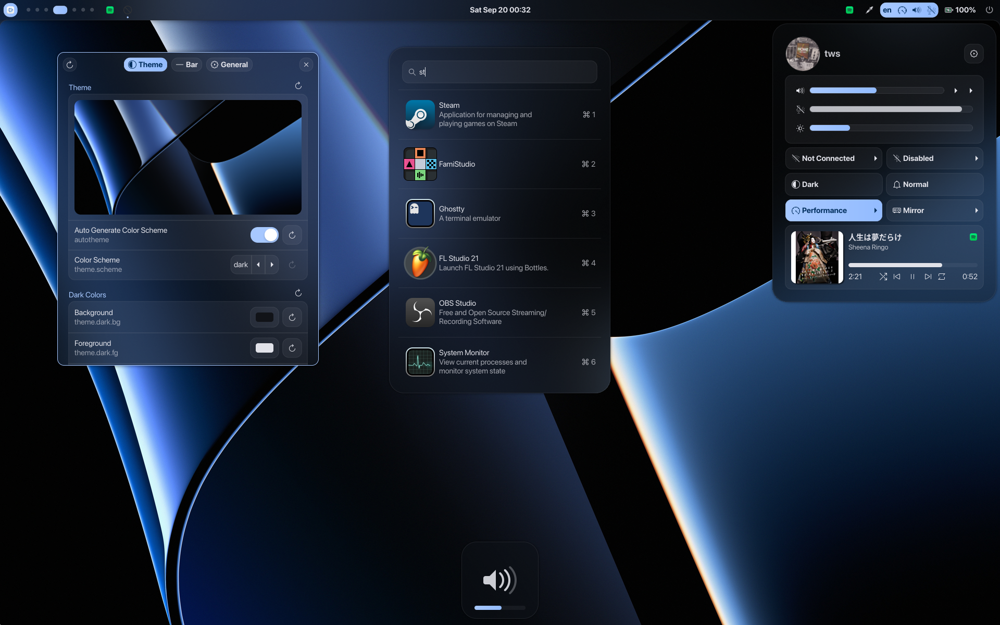

# ags2-shell



A port of Aylur's AGS shell from AGS v1 to AGS v2, with a subset of features. Designed for use with Hyprland.

## Acknowledgments
Special thanks to [Aylur](https://github.com/Aylur) for the original [AGS v1 shell](https://github.com/Aylur/dotfiles/tree/18b83b2d2c6ef2b9045edefe49a66959f93b358a), [Astal](https://github.com/Aylur/Astal), and the [AGS CLI](https://github.com/Aylur/ags).

Check out and support his latest project **[Marble Shell](https://marble-shell.pages.dev/pages/installation)**, the new and expanded version of the AGS shell with more features and improvements.

## ⚠ Known Issues
- Duplicate top bar when mirroring or demirroring a screen.
- Lack of user-friendly feedback when a Bluetooth adapter is either missing or rfkilled.
- Wi-Fi menu simply does not work when the adapter is in monitor mode due to the absence of dynamic binding.
- Launcher's app list may not automatically update after installing new apps (a relaunch bind is recommended).
- The launcher retract animation does not activate during toggle, but works as expected when the launcher loses focus or when the Escape key is pressed.

## 📌 Planned Improvements
- GTK4 rewrite
- Greeter implementation

## Installation on NixOS
At present, there is no bundled package. You can install it through Home Manager by adding the following configuration:

flake.nix:
```nix
{}: {
  inputs = {
    apple-fonts.url = "github:Lyndeno/apple-fonts.nix";
    matugen.url = "github:InioX/matugen?ref=v2.2.0";
    ags = {
      url = "github:Aylur/ags";
      inputs.nixpkgs.follows = "nixpkgs";
    };
    astal.url = "github:Aylur/astal";
  };
}
```

Home Manager:
```nix
{
inputs,
pkgs,
...
}: {
  imports = [inputs.ags.homeManagerModules.default];
  programs.ags = {
    enable = true;
    configDir = ../ags; # Path to this repository
    extraPackages = with pkgs; [
      dart-sass
      brightnessctl
      swww
      which
      libnotify
      libheif
      wf-recorder
      wl-clipboard
      slurp
      wayshot
      swappy
      hyprpicker
      pavucontrol
      networkmanager
      gtk3
      gtk4
      inputs.matugen.packages.${system}.default
      inputs.ags.packages.${pkgs.system}.apps
      inputs.ags.packages.${pkgs.system}.battery
      inputs.ags.packages.${pkgs.system}.hyprland
      inputs.ags.packages.${pkgs.system}.wireplumber
      inputs.ags.packages.${pkgs.system}.network
      inputs.ags.packages.${pkgs.system}.tray
      inputs.ags.packages.${pkgs.system}.battery
      inputs.ags.packages.${pkgs.system}.notifd
      inputs.ags.packages.${pkgs.system}.mpris
      inputs.ags.packages.${pkgs.system}.bluetooth
      inputs.ags.packages.${pkgs.system}.auth
      inputs.ags.packages.${pkgs.system}.powerprofiles
      inputs.apple-fonts.packages.${pkgs.system}.sf-pro-nerd
    ];
  };
}
```

## Hyprland Keybinds (Home Manager)
To integrate with Hyprland, add the following key bindings to your configuration:

```nix
bind = let
e = "exec, ags -i ags-main";
in
[
  # Restart AGS shell (recommended if the launcher's app list doesn't update)
  "CTRL ALT, Delete, ${e} quit; ags run"
  # Open the application launcher
  "SUPER, R,         ${e} toggle launcher"
  # Open workspace overview
  "SUPER, Tab,       ${e} toggle overview"
  # Display shutdown confirmation prompt
  ",XF86PowerOff,    ${e} request 'shutdown'"
  # Start region recording
  "SUPER, Print,     ${e} request 'record-area'"
  # Start full-screen recording
  "SUPER SHIFT, Print, ${e} request 'record'"
]
```
